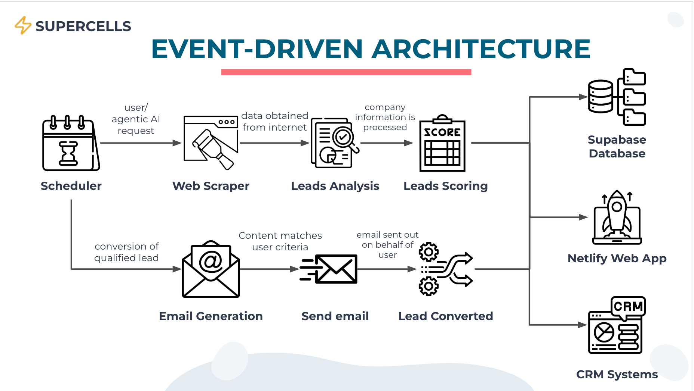

# SUPERCELLS ⚡️

SUPERCELLS levereges on Agentic AI to capture, nurture, convert and revolutionize personalised lead strategies. Customise your own personal AI avatar, each designed for different sales strategies. Sit back and relax as your AI avatar autonomously find and engages potential clients based on your instructions.

<p align="center">
  
</p>

## Watch the Demo

See Supercells in action! Click below to watch a demonstration of our platform's capabilities:

<p align="center">
  <a href="https://youtu.be/qU6f5nGtU8E?si=oDCOboK08aOjRrx4" title="Supercells Demo">
    
  </a>
</p>

## Table of Contents
1. [Watch the Demo](#watch-the-demo)
2. [Collaborators](#collaborators)
3. [Overview](#overview)
4. [Key Features](#key-features)
5. [System Architecture](#system-architecture)
6. [Technology Stack](#technology-stack)
7. [Getting Started](#getting-started)
8. [Future Developments](#future-developments)

## Collaborators

Built for NTU's CAmpcOde Hackathon 2025 - Code with AI, The SUPERCELLS project is made possible by the contributions of the following individuals:

| Name | GitHub | LinkedIn |
|------|--------|----------|
| Nicole Ang | [](https://github.com/nicoleang18) | [](https://www.linkedin.com/in/nicoleang18/) |
| Teow Choon Ray | [](https://github.com/TeowChoonRay) | [](https://www.linkedin.com/in/choonray/) |
| Chloe Yeo | [](https://github.com/itschloechloe) | [](https://www.linkedin.com/in/chloeyeo-yangenxi/)|
| Ryan Phua | [](https://github.com/ryanphua) | [](https://www.linkedin.com/in/ryanphua02/) |

## Overview

SUPERCELLS is an AI-powered lead qualification platform designed to help AI solutions providers identify, engage, and convert high-potential leads with maximum efficiency. By leveraging Agentic AI, Supercell goes beyond traditional lead generation — it autonomously analyzes leads, engages prospects, and optimizes strategies to improve sales outcomes.

## Key Features

- **Agentic AI Avatars** - Choose from customizable AI avatars tailored to different sales strategies
- **AI-Powered Lead Qualification** - Dynamic scoring models which assess Company Profile, Budget Alignment, Relationship Strength, Business Needs & AI Adoption Signals
- **Automated Lead Engagement** - Autonomously drafts and sends personalized messages to leads with customisable dynamic tones
- **Manual Lead Management** - Add, filter, and manage leads manually for flexibility
- **CRM Integration** - Supports bi-directional sync with major CRM platforms like Hubspot and Salesforce
- **Chatbot** - Discuss lead matters with our friendly AI avatars

## System Architecture
<p align="center">
  
</p>

## Technology Stack

### Frontend
- [Vite](https://vite.dev) - Lightning-fast build tool optimized for modern JavaScript frameworks like React
- [React](https://reactjs.org) - UI library
- [TypeScript](https://www.typescriptlang.org) - Typed JavaScript
- [Tailwind CSS](https://tailwindcss.com) - Utility-first CSS framework
- [ShadCN UI](https://ui.shadcn.com) - Component library
- [Three.js](https://threejs.org) - 3D visualization library

### Backend
- [Supabase](https://supabase.com) - PostgreSQL database backend

### AI
- [OpenAI API](https://openai.com) - GPT models for text processing
- [CRM API](https://www.hubspot.com) -  Bi-directional sync for managing leads, contacts, and deal statuses.

### Infrastructure
- [Bolt.New](https://bolt.new) -  Fast prototyping tool with seamless deployment to Vercel
- [Netlify](https://www.netlify.com) -  Scalable deployment platform for serverless functions, frontend hosting, and CI/CD workflows

## Getting Started

1. **Clone the repository**
   ```bash
   git clone https://github.com/TeowChoonRay/Supercells.git
   cd Supercells/supercells
   ```

2. **Install dependencies**
   ```bash
   npm install
   ```

3. **Set up environment variables**
   Create a `.env` file in the `supercells` directory:
   ```env
   # Database
   VITA_SUPABASE_ANON_KEY = your_supabase_anon_key
   VITA_SUPABASE_URL = your_supabase_url

   # OpenAI
   VITA_OPENAI_API_KEY=your_openai_api_key
   ```

4. **Start development server**
   ```bash
   npm run dev
   ```

## Future Developments
SUPERCELLS is continuously evolving:

- **Enhanced Social Media Integration** - Direct connections to more platforms
- **Expanded API Ecosystem** - Integration with more third-party tools
- **Real-time Alert System** - Immediate notifications for critical threats
- **Customisabl Avatar** - Brand design and Gamification
